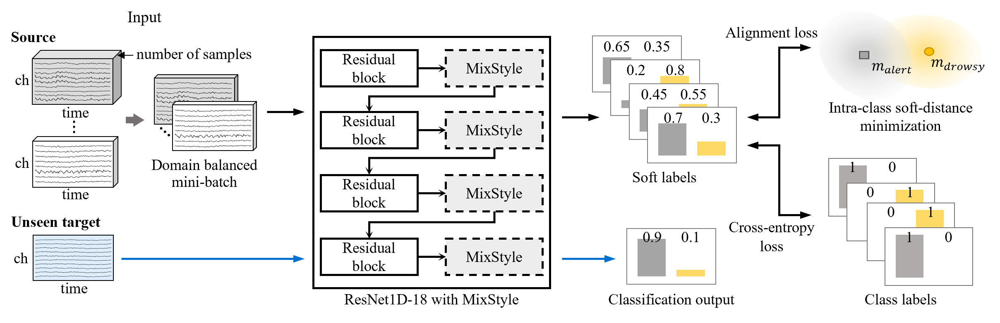

# EEG-based Driver Drowsiness Classification via Calibration-Free Framework with Domain Generalization. (SMC 2022, Oral)

This is an official repo for EEG-based Driver Drowsiness Classification via Calibration-Free Framework with Domain Generalization. [\[Paper\]](https://ieeexplore.ieee.org/abstract/document/9945216)

## Description

We propose an EEG-based driver drowsiness state (i.e., alert and drowsy) classification framework for calibration-free BCI from the domain generalization perspective. We gathered samples from  all the subjects/domains in a domain-balaced and class-balanced manner an composed a mini-batch. We combined the style features of multi-domain instances for data augmentation to generate unseen domains. Moreover, we aligned the class relationship by minimizing the distance of label distribution within classes. The distance between the center of soft labels and each soft labels within each class is minimized.



## Getting Started

1. Environment Requirement.

```terminal
conda create -n MixAlign python=3.8.13
conda activate MixAlign
pip install -r requirements.txt
```

## Data preparation

First, create a folder `${DATASET_DIR}` to store the data of each subject.

The directory structure should look like this:

```
${DATASET_DIR}
	|--${S1}
        |--${S2}
	|--${...}
```

### Training from scratch
```
# train
python TotalMain.py --mode train
# test
python TotalMain.py --mode infer
```

The results are saved in `${Project_Dir}/{seed}_{step}_{alignment loss weight}/{model_name}` by default


## Citation

```
@inproceedings{kim2022eeg,
  title={EEG-based Driver Drowsiness Classification via Calibration-Free Framework with Domain Generalization},
  author={Kim, Dong-Young and Han, Dong-Kyun and Jeong, Ji-Hoon and Lee, Seong-Whan},
  booktitle={2022 IEEE International Conference on Systems, Man, and Cybernetics (SMC)},
  pages={2293--2298},
  year={2022},
  organization={IEEE}
}
```
